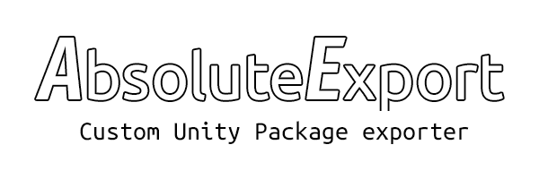
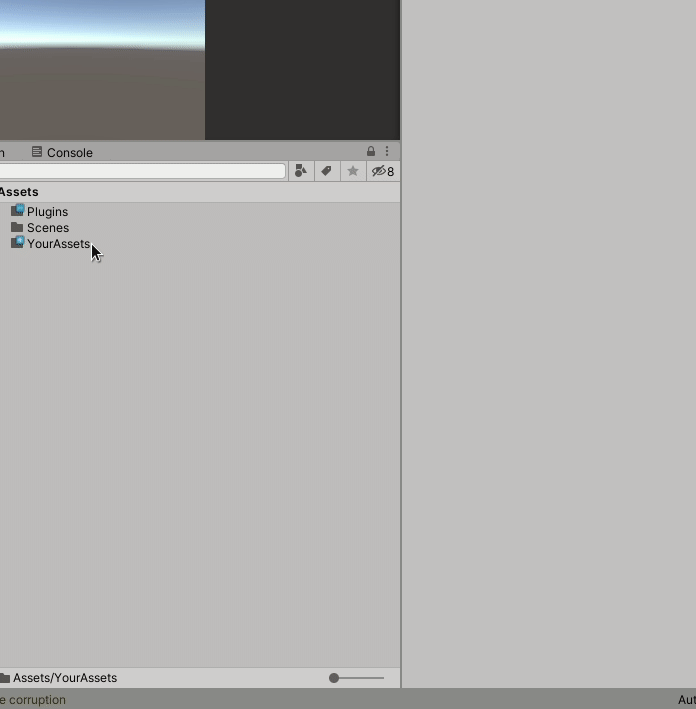
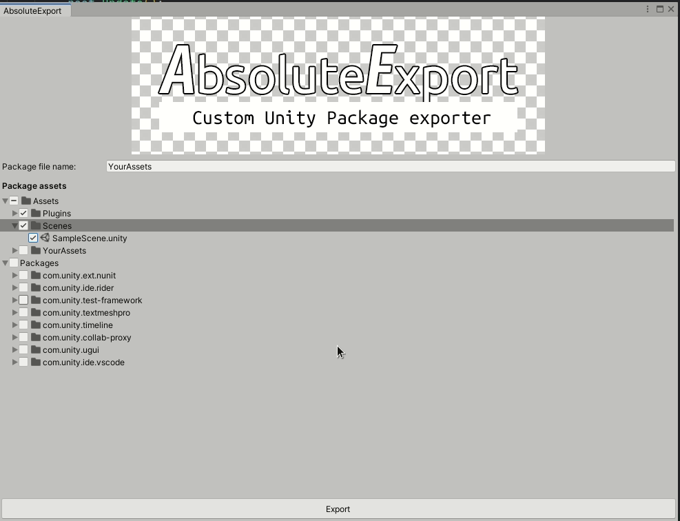

**AbsoluteExport** is a simple plugin for Unity that helps easier export your assets to UnityPackage's for transferring.

### This plugin can:
- Create custom window for including assets into your package.
- Include UPM packages.
- Search for additional asset depencieses (through GUIDes in scenes and prefabs).
- Search for static resources usage in code.
- Search for cginc files (according to [this](https://issuetracker.unity3d.com/issues/shadercompiler-shaders-do-not-get-recompiled-on-changes-in-includes) Unity bug that only partionally fixed).

### How to use?
1. Download unitypackage file and import to your project.
2. In "Project View" window right click on needed asset or directory, and select AbsoluteExport/Export complete package. 
3. AbsoluteExport collect all depencieses and set checks on that. But you can change it and export only that what you want. 
4. Save it and have fun ;)

### Important note
Selecting assets works correctly only with file browsing area in "Project View" window. Dont try to use it on files from left file tree, etc.